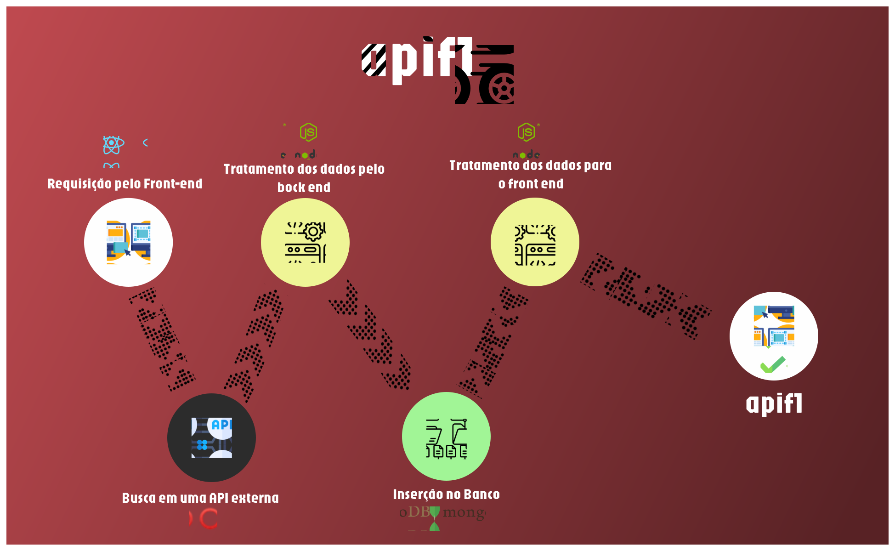

# API F1 


## Esta API sobre Fórmula 1 é utilizada para gerenciar informações das equipes de corridas.



<br>

# Tecnologias Essenciais
  
 
   
	 
     

<br>

# API EXTERNA
Estamos consumindo uma API externa para tratamento dos dados chamada <b>OpenF1</b>

 

<br>

# EndPoints
<details>
  <summary>Detalhes</summary>
  
  ## - POST /team

- ``` router.post("/team", teamController.createOrUpdateTeamByName); ```

	- Esse endpoint é responsável por cadastrar uma equipe.

<b>Exemplo de um JSON para inserir e cadastrar 2 equipes no sistema</b>

``` 
"teams": [
		{
			"_id": "66d9c7a64832b4b8b6d99f13",
			"name": "Mercedes",
			"teamColour": "6CD3BF",
			"teamLogoUrl": "https://www.formula1.com/content/dam/fom-website/teams/mercedes_logo.png",
			"drivers": [
				{
					"name": "Lewis HAMILTON",
					"nationality": "GBR",
					"number": 44,
					"headshotUrl": "https://www.formula1.com/content/dam/fom-website/drivers/L/LEWHAM01_Lewis_Hamilton/lewham01.png.transform/1col/image.png",
					"flagUrl": "https://flagcdn.com/w320/gbr.png",
					"_id": "66d9c7a64832b4b8b6d99f14"
				},
				{
					"name": "George RUSSELL",
					"nationality": "GBR",
					"number": 63,
					"headshotUrl": "https://www.formula1.com/content/dam/fom-website/drivers/G/GEORUS01_George_Russell/georus01.png.transform/1col/image.png",
					"flagUrl": "https://flagcdn.com/w320/gbr.png",
					"_id": "66d9c7a64832b4b8b6d99f15"
				}
			],
			"__v": 0
		},
		{
			"_id": "66da007af3dc0263c30d7366",
			"name": "Red Bull Racing",
			"teamColour": "#FF0000",
			"teamLogoUrl": "/static/teams/Red Bull Racing.png",
			"drivers": [
				{
					"name": "Max VERSTAPPEN",
					"nationality": "NED",
					"number": 1,
					"headshotUrl": "https://www.formula1.com/content/dam/fom-website/drivers/M/MAXVER01_Max_Verstappen/maxver01.png.transform/1col/image.png",
					"flagUrl": "/static/flags/NED.jpg",
					"_id": "66da007af3dc0263c30d7367"
				},
				{
					"name": "Sergio PEREZ",
					"nationality": "MEX",
					"number": 11,
					"headshotUrl": "https://www.formula1.com/content/dam/fom-website/drivers/S/SERPER01_Sergio_Perez/serper01.png.transform/1col/image.png",
					"flagUrl": "/static/flags/MEX.jpg",
					"_id": "66da007af3dc0263c30d7368"
				}
			],
			"__v": 0
		}
		]
```
<br>

## - GET /teams

- ``` router.get("/teams", teamController.getAllTeams); ```
	- Esse endpoint é responsável por mostrar todas as equipes.

<b>Ao ser consumida por uma aplicação FrontEnd, ou utilizando ferramentes de requisição HTTP os dados podem ser listados</b>

 

<br>

## - GET /team/id

- ``` router.get("/team/:id", teamController.getOneTeam); ```
	- Esse endpoint mostra apenas uma das equipes selecionada pelo seu ID.


<br>

## - GET /team/name/nomeEquipe

- ``` router.get("/team/name/:name", teamController.getOneTeamByName);```
	- Esse endpoint mostra uma das equipes selecionada pelo seu nome.
## PUT /team/id

- ```router.put("/team/:id", teamController.updateTeam);```
	- Esse endpoint atualiza os dados da equipe selecionada.

## DELETE /team/id

- ```router.delete("/team/:id", teamController.deleteTeam);```
	- Esse endpoint deleta os dados da equipe selecionada.

<br>

## Respostas:
### OK 200
Caso essa resposta aconteça, a requisição foi um sucesso.

### No Content 204
Caso essa resposta aconteça, a equipe foi deletada com sucesso e não há nada para retornar ao usuário.

	- Exemplo de resposta: No body returned for response.

### Not Found 404
Caso essa resposta aconteça, significa que a equipe com o id fornecido não foi encontrada.

Exemplo de resposta:

```
{
  "error": "Equipe não encontrada."
}
```

### Internal Server Error 500
Caso essa resposta aconteça, significa que ocorreu um erro interno no servidor. Motivos podem incluir falhas na comunicação com o banco de dados.

Exemplo de resposta:

```
{
    "error": "Erro interno no servidor."
}
```

</details>

<br>

# Services
<details>
  <summary>Detalhes</summary>

## Código de Tratamento da API externa e serviço de criação dos dados personalizados para o Banco

``` 
import axios from "axios";
import Team from "../models/Team.js";

// Função para buscar dados da API OpenF1 e atualizar a equipe com base no nome
const fetchAndUpdateTeamByName = async (teamName) => {
  try {
    // URL da API OpenF1 para pilotos da equipe
    const apiUrl = `https://api.openf1.org/v1/drivers?team_name=${teamName}&session_key=9158`;

    // Requisição para a API OpenF1
    const response = await axios.get(apiUrl);
    const driversData = response.data;

    // Verifica se dados dos pilotos foram encontrados
    if (!driversData || driversData.length === 0) {
      throw new Error("Pilotos não encontrados na API.");
    }

    // Pega a cor da equipe do primeiro piloto (todos os pilotos têm a mesma cor de equipe)
    const teamColour = `#${driversData[0].team_colour}`;

    // Nome do arquivo da logo da equipe
    const teamLogoFileName = `${teamName}.png`;  // Nome do arquivo, deve estar na pasta 'public/teams/'

    // Mapeia os dados dos pilotos para o formato desejado
    const updatedDrivers = driversData.map(driver => {
      const flagFileName = `${driver.country_code}.jpg`;  // Nome do arquivo da bandeira, deve estar na pasta 'public/flags/'
      console.log(`Flag File Name: ${flagFileName}`);  // Adiciona log para depuração

      return {
        name: driver.full_name,
        nationality: driver.country_code,
        number: driver.driver_number,
        headshotUrl: driver.headshot_url,
        flagUrl: flagFileName,
      };
    });

    // Cria ou atualiza a equipe com os dados dos pilotos, cor e logo
    let team = await Team.findOne({ name: teamName });
    if (team) {
      team.drivers = updatedDrivers;
      team.teamLogoUrl = teamLogoFileName;
      team.teamColour = teamColour;
      await team.save();
      console.log(`Equipe ${teamName} atualizada.`);
    } else {
      team = new Team({
        name: teamName,
        teamLogoUrl: teamLogoFileName,  // Adiciona a logo da equipe
        teamColour: teamColour,        // Adiciona a cor da equipe
        drivers: updatedDrivers,
      });
      await team.save();
      console.log(`Equipe ${teamName} criada.`);
    }
  } catch (error) {
    console.error("Erro ao buscar e atualizar a equipe:", error);
  }
};

export default { fetchAndUpdateTeamByName };

```

</details>

<br>

# Controllers

<details>
<summary>Detalhes</summary>

### GET ALL TEAMS

- Função para listar todas as equipes
 ``` 
 const getAllTeams = async (req, res) => {
	try {
		const teams = await Team.find();
   	    res.status(200).json({ teams });
    } catch (error) {
    console.error("Erro ao listar equipes:", error);
    res.status(500).json({ error: "Erro interno no servidor." });
   }
};
```

### CREATE OR UPDATE TEAM BY NAME

- Função para criar ou atualizar uma equipe com base no nome fornecido

```
const createOrUpdateTeamByName = async (req, res) => {
  try {
    const { name } = req.body;

    if (!name) {
      return res.status(400).json({ error: "Nome da equipe é obrigatório." });
    }

    // Busca e atualiza a equipe com base no nome
    await teamService.fetchAndUpdateTeamByName(name);

    // Recupera a equipe atualizada do banco de dados
    const team = await Team.findOne({ name });
    if (!team) {
      return res.status(404).json({ error: "Equipe não encontrada no banco de dados." });
    }

    res.status(200).json({ team });
  } catch (error) {
    console.error("Erro ao criar ou atualizar a equipe:", error);
    res.status(500).json({ error: "Erro interno no servidor." });
  }
};
```

### DELETE TEAM

- Função para deletar uma equipe

```
const deleteTeam = async (req, res) => {
  try {
    const { id } = req.params;
    await Team.findByIdAndDelete(id);
    res.status(204).send(); // No Content
  } catch (error) {
    console.error("Erro ao deletar a equipe:", error);
    res.status(500).json({ error: "Erro interno no servidor." });
  }
};
```

### UPDATE TEAM

- Função para atualizar uma equipe

```
const updateTeam = async (req, res) => {
  try {
    const { id } = req.params;
    const { name, foundationYear, base, teamColour } = req.body;
    const updatedTeam = await Team.findByIdAndUpdate(
      id,
      { name, foundationYear, base, teamColour }, // Incluindo a cor da equipe na atualização
      { new: true }
    );
    if (!updatedTeam) {
      return res.status(404).json({ error: "Equipe não encontrada." });
    }
    res.status(200).json({ team: updatedTeam });
  } catch (error) {
    console.error("Erro ao atualizar a equipe:", error);
    res.status(500).json({ error: "Erro interno no servidor." });
  }
};
```

### GET ONE TEAM

- Função para listar uma única equipe

```
const getOneTeam = async (req, res) => {
  try {
    const { id } = req.params;
    const team = await Team.findById(id);
    if (!team) {
      return res.status(404).json({ error: "Equipe não encontrada." });
    }
    res.status(200).json({ team });
  } catch (error) {
    console.error("Erro ao buscar a equipe:", error);
    res.status(500).json({ error: "Erro interno no servidor." });
  }
};
```

### GET ONE TEAM BY NAME

- Função para listar uma única equipe pelo nome

```
export const getOneTeamByName = async (req, res) => {
  try {
    const { name } = req.params; // Pega o nome da equipe da URL
    const team = await Team.findOne({ name: name }); // Busca a equipe pelo nome no banco de dados

    if (!team) {
      return res.status(404).json({ error: "Equipe não encontrada." });
    }

    res.status(200).json({ team });
  } catch (error) {
    console.error("Erro ao buscar a equipe:", error);
    res.status(500).json({ error: "Erro interno no servidor." });
  }
};
```
</details>

<br>

*OBS: Os códigos presentes na documentação não estão 100% completos, clone o repositório e consulte o código bruto*

<br>


